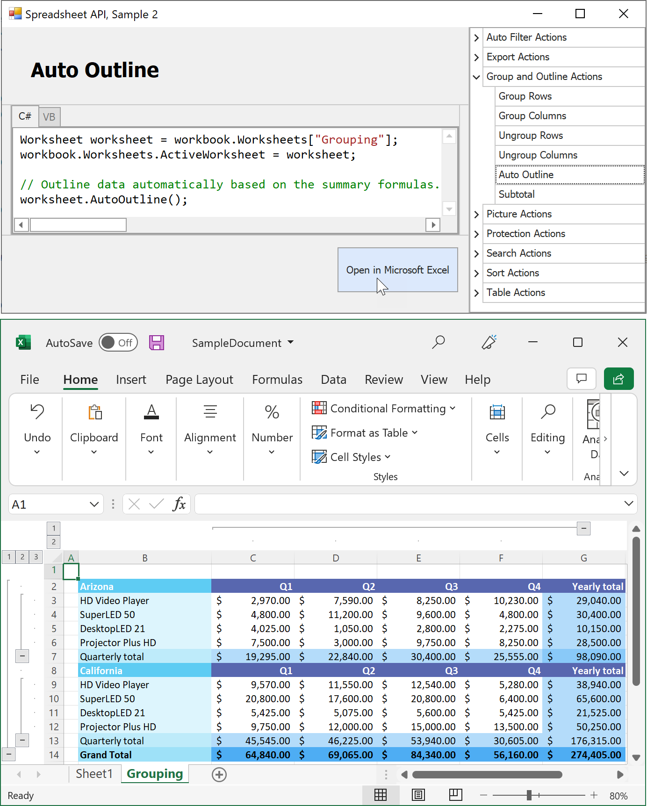

<!-- default badges list -->

<!-- default badges end -->
# Spreadsheet Document API – How to Process Excel Workbooks in Code (Part 2)

The [DevExpress Spreadsheet Document API](https://docs.devexpress.com/OfficeFileAPI/14912/spreadsheet-document-api) is a non-visual library that allows you to generate, import, export, modify, and print Microsoft Excel workbooks in code. 

> You need a license for the [DevExpress Office File API Subscription](https://www.devexpress.com/products/net/office-file-api/) or [DevExpress Universal Subscription](https://www.devexpress.com/subscriptions/universal.xml) to use this library in production code. 

This example demonstrates how to use the Spreadsheet Document API to execute the following actions:

-	Apply filters to a worksheet range (a dynamic filter, the “Top 10” filter, number, text, and date filters) 
-	Save a worksheet in HTML format
-	Group and ungroup worksheet rows and columns
-	Outline worksheet data automatically
-	Create subtotals for a cell range
-	Insert a picture into a worksheet and modify an embedded picture
-	Protect and unprotect a workbook and worksheet
-	Protect specific worksheet ranges
-	Sort data in a range
-	Manage tables and table styles
-	Search for specific data in a worksheet

The application form contains the list of supported operations and the editor that allows you to view and edit the source code for each operation. Select an operation, modify its code if necessary, and click **Open in Microsoft Excel** to open the resulting spreadsheet document in Microsoft Excel.
If an error occurs during compilation or execution, the background color of the code editor changes to pink.

<!-- default file list -->
## Files to Look At

- [AutoFilterActions.cs](./CS/SpreadsheetDocServerAPIPart2/CodeExamples/AutoFilterActions.cs) (VB: [AutoFilterActions.vb](./VB/SpreadsheetDocServerAPIPart2/CodeExamples/AutoFilterActions.vb))
- [ExportActions.cs](./CS/SpreadsheetDocServerAPIPart2/CodeExamples/ExportActions.cs) (VB: [ExportActions.vb](./VB/SpreadsheetDocServerAPIPart2/CodeExamples/ExportActions.vb))
- [GroupAndOutlineActions.cs](./CS/SpreadsheetDocServerAPIPart2/CodeExamples/GroupAndOutlineActions.cs) (VB: [GroupAndOutlineActions.vb](./VB/SpreadsheetDocServerAPIPart2/CodeExamples/GroupAndOutlineActions.vb))
- [PictureActions.cs](./CS/SpreadsheetDocServerAPIPart2/CodeExamples/PictureActions.cs) (VB: [PictureActions.vb](./VB/SpreadsheetDocServerAPIPart2/CodeExamples/PictureActions.vb))
- [ProtectionActions.cs](./CS/SpreadsheetDocServerAPIPart2/CodeExamples/ProtectionActions.cs) (VB: [ProtectionActions.vb](./VB/SpreadsheetDocServerAPIPart2/CodeExamples/ProtectionActions.vb))
- [SearchActions.cs](./CS/SpreadsheetDocServerAPIPart2/CodeExamples/SearchActions.cs) (VB: [SearchActions.vb](./VB/SpreadsheetDocServerAPIPart2/CodeExamples/SearchActions.vb))
- [SortActions.cs](./CS/SpreadsheetDocServerAPIPart2/CodeExamples/SortActions.cs) (VB: [SortActions.vb](./VB/SpreadsheetDocServerAPIPart2/CodeExamples/SortActions.vb))
- [TableActions.cs](./CS/SpreadsheetDocServerAPIPart2/CodeExamples/TableActions.cs) (VB: [TableActions.vb](./VB/SpreadsheetDocServerAPIPart2/CodeExamples/TableActions.vb))

<!-- default file list end -->

## Documentation

-	[Filter Data](https://docs.devexpress.com/OfficeFileAPI/113729/spreadsheet-document-api/examples/filtering)
-	[Export a Document to HTML](https://docs.devexpress.com/OfficeFileAPI/113724/spreadsheet-document-api/examples/workbooks/how-to-export-a-document-to-html)
-	[Group Data](https://docs.devexpress.com/OfficeFileAPI/113730/spreadsheet-document-api/examples/grouping)
-	[Pictures](https://docs.devexpress.com/OfficeFileAPI/113733/spreadsheet-document-api/examples/pictures)
-	[Protection](https://docs.devexpress.com/OfficeFileAPI/113734/spreadsheet-document-api/examples/protection)
-	[Search](https://docs.devexpress.com/OfficeFileAPI/113731/spreadsheet-document-api/examples/search)
-	[Sorting](https://docs.devexpress.com/OfficeFileAPI/113728/spreadsheet-document-api/examples/sorting)
-	[Tables](https://docs.devexpress.com/OfficeFileAPI/403308/spreadsheet-document-api/spreadsheet-tables)

## More Examples

- [Spreadsheet Document API - Part 1](https://github.com/DevExpress-Examples/spreadsheet-document-api-examples-part1)
- [Spreadsheet Document API - Part 3](https://github.com/DevExpress-Examples/spreadsheet-document-api-part-3)